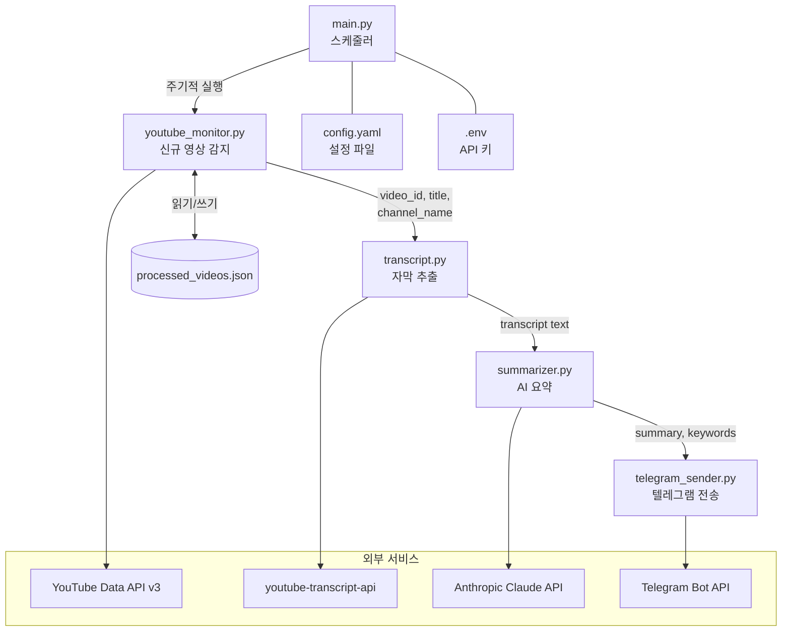

# YouTube → Telegram 자동 요약 봇 기술 설계서

## 1. 전체 아키텍처

### 파이프라인 다이어그램



### 데이터 흐름 요약

| 단계 | 입력 | 처리 | 출력 |
|------|------|------|------|
| 1. 영상 감지 | 채널 ID 목록 | YouTube API로 최신 영상 조회, 중복 필터링 | 신규 영상 정보 리스트 (`video_id`, `title`, `channel_name`, `published_at`) |
| 2. 자막 추출 | `video_id` | 한국어 자막 우선 추출, 없으면 영어 | 자막 텍스트 (plain text) |
| 3. AI 요약 | 자막 텍스트 | Claude API로 3~5문장 요약 + 키워드 추출 | `summary` (str), `keywords` (list[str]) |
| 4. 텔레그램 전송 | 영상 정보 + 요약 + 키워드 | 메시지 포맷팅 후 Telegram Bot API 전송 | 전송 성공/실패 여부 |

---

## 2. 모듈별 상세 설계

### 2.1 main.py — 진입점 + 스케줄러

**역할:** 프로그램 진입점. 설정 파일을 로드하고, 스케줄러를 통해 파이프라인을 주기적으로 실행한다.

**주요 함수:**

| 함수명 | 파라미터 | 반환값 | 설명 |
|--------|----------|--------|------|
| `main()` | 없음 | `None` | 설정 로드 → 로깅 초기화 → 스케줄러 시작 |
| `load_config(path: str)` | `path`: config.yaml 경로 | `dict` | YAML 설정 파일 파싱 |
| `run_pipeline(config: dict)` | `config`: 설정 딕셔너리 | `None` | 감지 → 자막 → 요약 → 전송 파이프라인 1회 실행 |
| `setup_logging(log_path: str)` | `log_path`: 로그 파일 경로 | `None` | 로깅 포맷 및 핸들러 설정 |

**외부 라이브러리:**

- `schedule` — 주기적 작업 실행
- `pyyaml` — YAML 설정 파일 파싱
- `python-dotenv` — .env 환경변수 로드

---

### 2.2 youtube_monitor.py — YouTube 신규 영상 감지

**역할:** YouTube Data API v3를 사용하여 지정된 채널들의 최신 영상을 확인하고, 이미 처리한 영상을 `processed_videos.json`으로 관리하여 중복을 방지한다.

**주요 함수/클래스:**

| 함수명 | 파라미터 | 반환값 | 설명 |
|--------|----------|--------|------|
| `get_latest_videos(channel_id: str, api_key: str, max_results: int = 5)` | `channel_id`: 채널 ID, `api_key`: YouTube API 키, `max_results`: 조회 개수 | `list[dict]` — `[{"video_id", "title", "channel_name", "published_at"}]` | 채널의 최신 영상 목록 조회 |
| `filter_new_videos(videos: list[dict], processed_path: str)` | `videos`: 영상 목록, `processed_path`: JSON 파일 경로 | `list[dict]` | 이미 처리된 영상을 제외한 신규 영상 반환 |
| `mark_as_processed(video_id: str, processed_path: str)` | `video_id`: 영상 ID, `processed_path`: JSON 파일 경로 | `None` | 처리 완료된 영상 ID를 JSON에 기록 |
| `load_processed_videos(processed_path: str)` | `processed_path`: JSON 파일 경로 | `set[str]` | 처리된 영상 ID 집합 로드 |

**processed_videos.json 구조:**

```json
{
  "processed": ["video_id_1", "video_id_2", "..."],
  "last_updated": "2026-03-10T12:00:00Z"
}
```

**외부 라이브러리:**

- `google-api-python-client` — YouTube Data API v3 클라이언트

---

### 2.3 transcript.py — 자막 추출

**역할:** `youtube-transcript-api`를 사용하여 영상의 자막을 추출한다. 한국어(`ko`) 자막을 우선 시도하고, 없으면 영어(`en`) 자막을 추출한다.

**주요 함수:**

| 함수명 | 파라미터 | 반환값 | 설명 |
|--------|----------|--------|------|
| `get_transcript(video_id: str, preferred_langs: list[str] = ["ko", "en"])` | `video_id`: 영상 ID, `preferred_langs`: 선호 언어 순서 | `str \| None` | 자막 텍스트 반환. 자막 없으면 `None` |
| `format_transcript(raw_transcript: list[dict])` | `raw_transcript`: API 원본 응답 (시간+텍스트 리스트) | `str` | 타임스탬프 제거, 텍스트만 이어붙여 정리 |

**외부 라이브러리:**

- `youtube-transcript-api` — YouTube 자막 추출

---

### 2.4 summarizer.py — AI 요약

**역할:** Anthropic Claude API를 사용하여 자막 텍스트를 3~5문장으로 핵심 요약하고, 주요 키워드를 추출한다.

**주요 함수:**

| 함수명 | 파라미터 | 반환값 | 설명 |
|--------|----------|--------|------|
| `summarize(transcript: str, api_key: str, model: str = "claude-sonnet-4-20250514")` | `transcript`: 자막 텍스트, `api_key`: Anthropic API 키, `model`: 모델명 | `dict` — `{"summary": str, "keywords": list[str]}` | 자막을 요약하고 키워드 추출 |
| `build_prompt(transcript: str)` | `transcript`: 자막 텍스트 | `str` | Claude에 전달할 프롬프트 생성 |
| `parse_response(response_text: str)` | `response_text`: Claude 응답 원문 | `dict` — `{"summary": str, "keywords": list[str]}` | Claude 응답을 파싱하여 구조화 |

**Claude 프롬프트 설계:**

```
다음은 YouTube 영상의 자막 스크립트입니다.

1. 핵심 내용을 3~5문장으로 요약해주세요.
2. 주요 키워드를 5개 이내로 추출해주세요.

아래 JSON 형식으로 응답해주세요:
{
  "summary": "요약 내용",
  "keywords": ["키워드1", "키워드2", ...]
}

---
{transcript}
```

**외부 라이브러리:**

- `anthropic` — Anthropic Claude API 공식 SDK

---

### 2.5 telegram_sender.py — 텔레그램 전송

**역할:** 요약 결과를 포맷팅하여 Telegram Bot API로 메시지를 전송한다.

**주요 함수:**

| 함수명 | 파라미터 | 반환값 | 설명 |
|--------|----------|--------|------|
| `send_summary(bot_token: str, chat_id: str, video_info: dict, summary: dict)` | `bot_token`: 봇 토큰, `chat_id`: 채팅방 ID, `video_info`: 영상 정보, `summary`: 요약 결과 | `bool` | 메시지 전송 성공 여부 |
| `format_message(video_info: dict, summary: dict)` | `video_info`: `{"title", "channel_name", "video_id"}`, `summary`: `{"summary", "keywords"}` | `str` | HTML 포맷 메시지 문자열 생성 |

**외부 라이브러리:**

- `python-telegram-bot` — Telegram Bot API 클라이언트

---

## 3. 설정 파일 스키마

### config.yaml

```yaml
# YouTube 모니터링 설정
youtube:
  channels:
    - id: "UCxxxxxxxxxxxxxxxxxxxxxx"
      name: "채널 이름 1"
    - id: "UCyyyyyyyyyyyyyyyyyyyyyy"
      name: "채널 이름 2"
  max_results: 5  # 채널당 최신 영상 조회 개수

# 스케줄러 설정
schedule:
  interval_minutes: 30  # 체크 주기 (분)

# 텔레그램 설정
telegram:
  chat_id: "123456789"  # 메시지를 보낼 채팅방 ID

# 자막 설정
transcript:
  preferred_languages:
    - "ko"
    - "en"

# 요약 설정
summarizer:
  model: "claude-sonnet-4-20250514"
  max_tokens: 1024

# 로깅 설정
logging:
  level: "INFO"
  file: "logs/bot.log"

# 데이터 저장 경로
data:
  processed_videos: "data/processed_videos.json"
```

### .env 환경변수

```
YOUTUBE_API_KEY=your_youtube_api_key_here
ANTHROPIC_API_KEY=your_anthropic_api_key_here
TELEGRAM_BOT_TOKEN=your_telegram_bot_token_here
```

**환경변수 설명:**

| 변수명 | 설명 | 발급처 |
|--------|------|--------|
| `YOUTUBE_API_KEY` | YouTube Data API v3 접근 키 | [Google Cloud Console](https://console.cloud.google.com/) |
| `ANTHROPIC_API_KEY` | Claude API 접근 키 | [Anthropic Console](https://console.anthropic.com/) |
| `TELEGRAM_BOT_TOKEN` | 텔레그램 봇 토큰 | [@BotFather](https://t.me/BotFather) |

---

## 4. 텔레그램 메시지 포맷

메시지는 HTML 파싱 모드로 전송한다.

### 메시지 템플릿

```
🎬 <b>{영상 제목}</b>

📺 채널: {채널명}

📝 <b>요약</b>
{3~5문장 요약}

🏷 <b>키워드</b>
#{키워드1} #{키워드2} #{키워드3} #{키워드4} #{키워드5}

🔗 <a href="https://www.youtube.com/watch?v={video_id}">영상 보기</a>
```

### 실제 전송 예시

```
🎬 GPT-5 출시일 확정? OpenAI 최신 발표 총정리

📺 채널: AI 뉴스 코리아

📝 요약
OpenAI가 차세대 모델 GPT-5의 출시 일정을 공식 발표했다.
새 모델은 멀티모달 성능이 대폭 향상되어 이미지와 영상 이해력이 크게 개선됐다.
API 가격은 기존 대비 40% 인하될 예정이며, 개발자 프리뷰가 다음 달 시작된다.
경쟁사 대비 추론 속도가 2배 이상 빨라질 것으로 기대된다.

🏷 키워드
#GPT5 #OpenAI #멀티모달 #AI모델 #API

🔗 영상 보기
```

---

## 5. 에러 처리 전략

### 기본 원칙

- 모든 에러는 로깅하고, 프로그램은 **중단하지 않는다** (graceful degradation).
- 개별 영상 처리 실패 시 해당 영상만 건너뛰고 다음 영상을 처리한다.
- 치명적 에러(API 키 누락 등)만 프로그램을 종료한다.

### 모듈별 예상 에러 및 대응

| 모듈 | 에러 상황 | 대응 방식 |
|------|-----------|-----------|
| **main.py** | config.yaml 누락/파싱 실패 | 에러 로깅 후 프로그램 종료 |
| **main.py** | .env 필수 변수 누락 | 에러 로깅 후 프로그램 종료 |
| **youtube_monitor.py** | API 할당량 초과 (403) | WARNING 로깅, 다음 주기에 재시도 |
| **youtube_monitor.py** | 네트워크 연결 실패 | WARNING 로깅, 다음 주기에 재시도 |
| **youtube_monitor.py** | 잘못된 채널 ID | ERROR 로깅, 해당 채널 건너뜀 |
| **youtube_monitor.py** | processed_videos.json 손상 | WARNING 로깅, 빈 상태로 초기화 |
| **transcript.py** | 자막 없음 (TranscriptsDisabled) | INFO 로깅, 해당 영상 건너뜀 |
| **transcript.py** | 지원 언어 없음 (NoTranscriptFound) | INFO 로깅, 해당 영상 건너뜀 |
| **summarizer.py** | API 인증 실패 (401) | ERROR 로깅, 해당 영상 건너뜀 |
| **summarizer.py** | Rate limit 초과 (429) | WARNING 로깅, 지수 백오프 후 재시도 (최대 3회) |
| **summarizer.py** | 응답 파싱 실패 | WARNING 로깅, 원본 응답을 그대로 summary로 사용 |
| **telegram_sender.py** | 봇 토큰 무효 (401) | ERROR 로깅, 해당 영상 건너뜀 |
| **telegram_sender.py** | chat_id 무효 (400) | ERROR 로깅, 해당 영상 건너뜀 |
| **telegram_sender.py** | 메시지 길이 초과 (4096자) | 메시지를 분할 전송 |
| **telegram_sender.py** | Rate limit (429) | 1초 대기 후 재시도 (최대 3회) |

### 로깅 설정

**로그 포맷:**

```
[%(asctime)s] %(levelname)s [%(name)s] %(message)s
```

**출력 예시:**

```
[2026-03-10 14:30:00] INFO [youtube_monitor] 채널 UCxxxx에서 신규 영상 2개 발견
[2026-03-10 14:30:01] INFO [transcript] 영상 dQw4w9WgXcQ 자막 추출 완료 (ko)
[2026-03-10 14:30:03] INFO [summarizer] 요약 완료 (347자)
[2026-03-10 14:30:04] INFO [telegram_sender] 메시지 전송 성공 (chat_id: 123456789)
[2026-03-10 14:30:05] WARNING [transcript] 영상 abc123의 자막을 찾을 수 없음 — 건너뜀
```

**로그 파일 경로:** `logs/bot.log`

- 콘솔(stdout)과 파일에 동시 출력
- 파일은 `RotatingFileHandler` 사용 (최대 5MB, 백업 3개)

---

## 6. 사용 라이브러리 목록

| 라이브러리 | 버전 | 용도 | 선택 이유 |
|-----------|------|------|-----------|
| `google-api-python-client` | >=2.100.0 | YouTube Data API v3 호출 | Google 공식 Python 클라이언트 |
| `youtube-transcript-api` | >=1.0.0 | YouTube 자막 추출 | 별도 API 키 불필요, 간편한 자막 접근 |
| `anthropic` | >=0.40.0 | Claude API 호출 | Anthropic 공식 SDK, 타입 지원 우수 |
| `python-telegram-bot` | >=21.0 | Telegram 메시지 전송 | 가장 널리 사용되는 텔레그램 봇 라이브러리 |
| `schedule` | >=1.2.0 | 주기적 작업 실행 | 단순 스케줄링에 적합, 경량 |
| `pyyaml` | >=6.0 | YAML 설정 파일 파싱 | Python YAML 파서 표준 |
| `python-dotenv` | >=1.0.0 | .env 파일 로드 | 환경변수 관리 사실상 표준 |

### requirements.txt

```
google-api-python-client>=2.100.0
youtube-transcript-api>=1.0.0
anthropic>=0.40.0
python-telegram-bot>=21.0
schedule>=1.2.0
pyyaml>=6.0
python-dotenv>=1.0.0
```

---

## 7. 프로젝트 디렉토리 구조

```
youtube-telegram-bot/
├── main.py                  # 진입점 + 스케줄러
├── youtube_monitor.py       # YouTube 신규 영상 감지
├── transcript.py            # 자막 추출
├── summarizer.py            # Claude AI 요약
├── telegram_sender.py       # 텔레그램 전송
├── config.yaml              # 설정 파일 (채널 목록, 주기 등)
├── .env.example             # 환경변수 템플릿
├── requirements.txt         # Python 의존성
├── README.md                # 프로젝트 설명
├── DESIGN.md                # 기술 설계서 (이 문서)
├── data/
│   └── processed_videos.json  # 처리 완료 영상 기록
└── logs/
    └── bot.log              # 애플리케이션 로그
```

---

## 8. 향후 확장 포인트

### 8.1 자막 없는 영상 처리 (Whisper 음성인식)

- `transcript.py`에서 자막 추출 실패 시 `whisper_fallback.py` 모듈로 위임
- OpenAI Whisper 또는 `faster-whisper`로 음성 → 텍스트 변환
- `yt-dlp`로 오디오만 다운로드 후 STT 처리
- 처리 시간이 길므로 비동기 처리 또는 별도 큐 도입 검토

### 8.2 다중 텔레그램 채널 지원

- `config.yaml`의 `telegram.chat_id`를 리스트로 확장
- 채널별로 구독하는 YouTube 채널을 다르게 설정 가능
- 채널 그룹 개념 도입: 특정 YouTube 채널 → 특정 텔레그램 채팅방 매핑

### 8.3 웹 대시보드 추가

- FastAPI + Jinja2 또는 Streamlit 기반 관리 대시보드
- 모니터링 현황 (최근 처리 영상, 에러 로그)
- 채널 추가/제거 UI
- 요약 히스토리 조회

### 8.4 GitHub Actions cron으로 서버리스 운영

- `.github/workflows/monitor.yml`로 스케줄 실행
- `processed_videos.json`은 GitHub Actions artifact 또는 별도 저장소(Gist, S3)에 보관
- 로컬 서버 없이 운영 가능
- 실행 주기: GitHub Actions cron 최소 단위 5분
